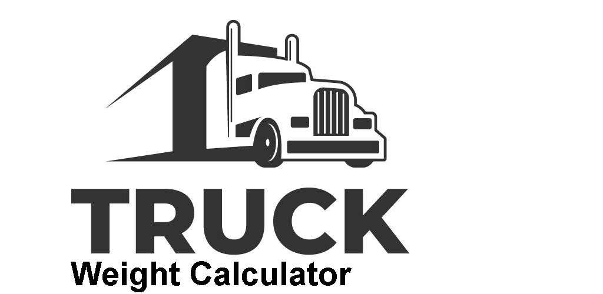

This app can speed up the process of using bridge scales by automatically calculating steering, drive, and trailer weights. It can also help you understand how much fuel you can add or burn to stay compliant. Additionally, it can **estimate** your axle weights using information from the _Bill of Lading_. A wind advisor is available for lighter loads, along with useful information on state weight limits.

*Support information* contact: *truckaxlecalc@gmail.com*

